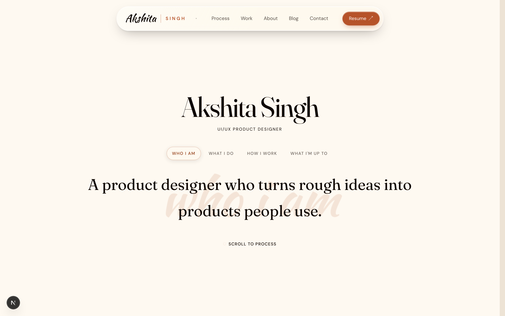
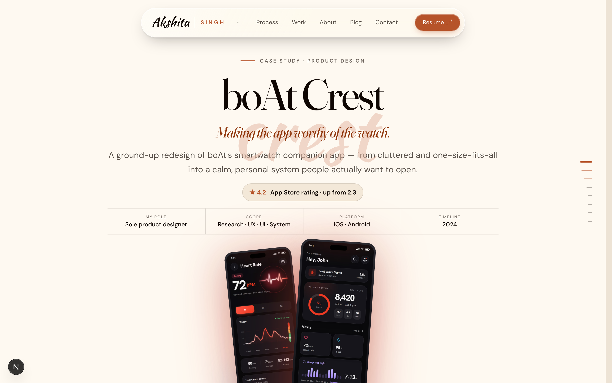
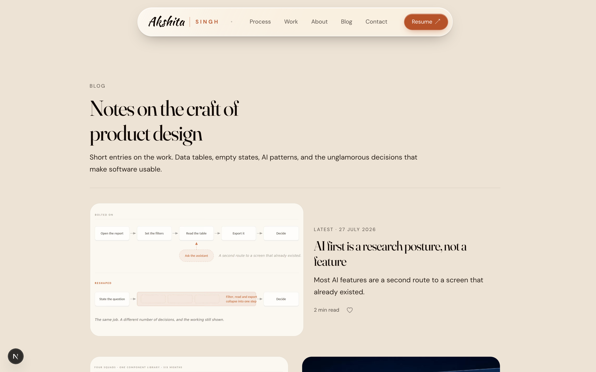
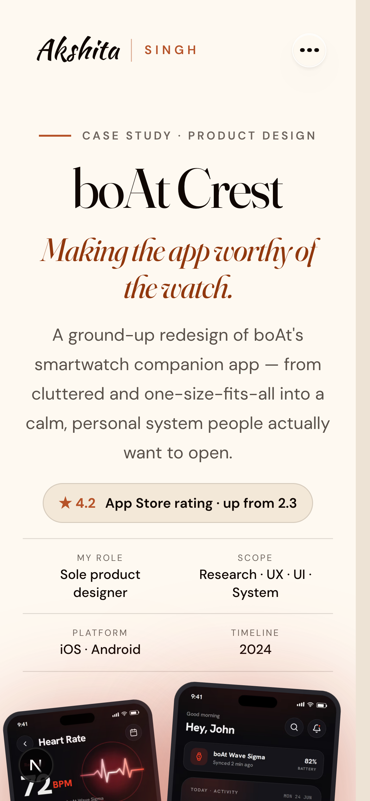
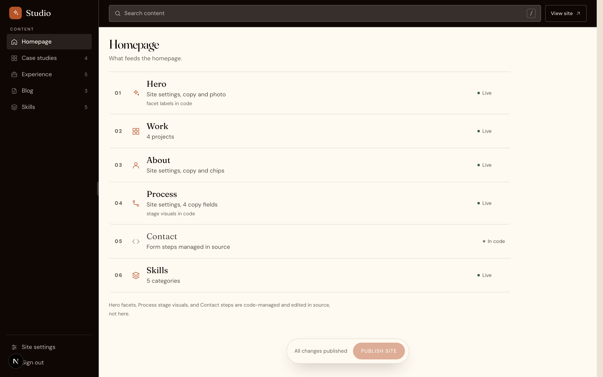
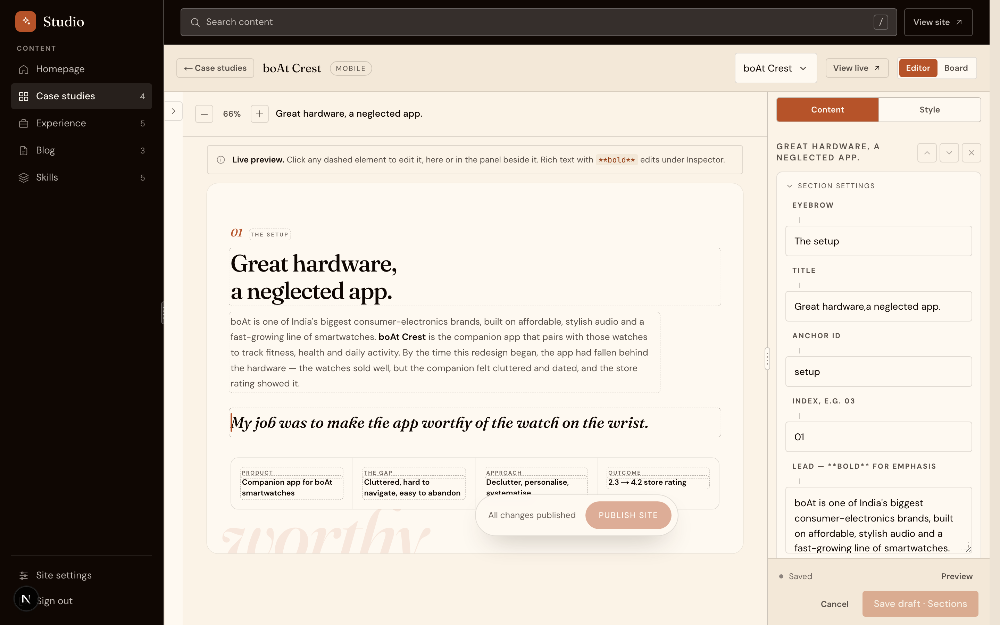
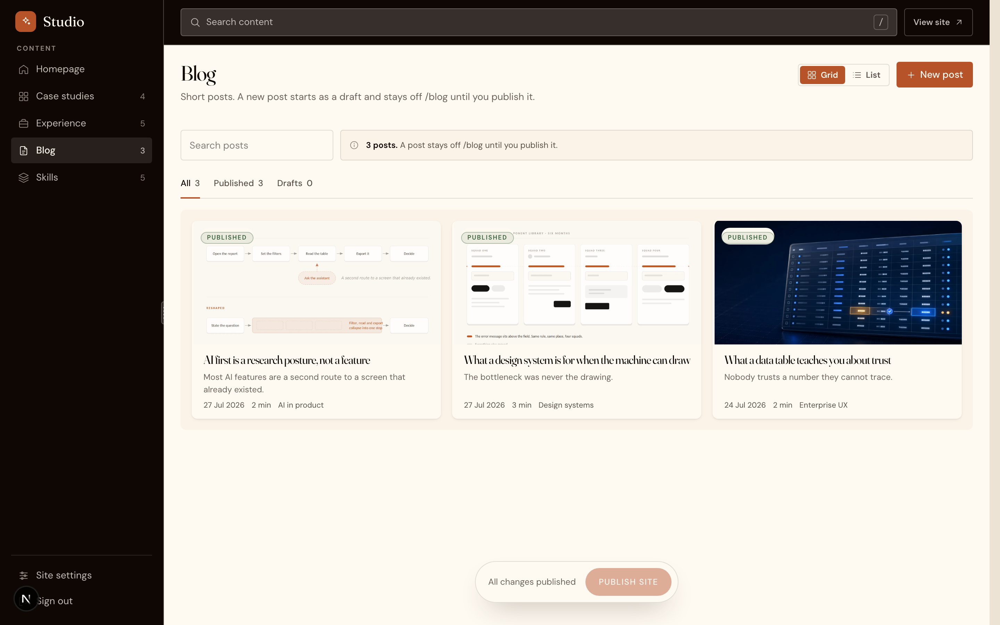

# akshitas.com

A portfolio site for a product designer, and the CMS that edits it.

Four case studies told as narratives rather than screenshot galleries, a blog, and **/studio** — a
custom editor where every word and image on the site is changed in place, on the page itself, and
published by merging a branch.

Next.js 15 · React 19 · TypeScript · Tailwind v4 · Vercel · [www.akshitas.com](https://www.akshitas.com)

---

## The site



One light editorial language across every page. Serif display type, a warm cream ground, a single
terracotta accent, and motion that is felt rather than watched.



**Every case study follows the same eleven-section spine** — thesis, summary, impact, context,
problem, goals, process, solution, a guided tour of the work, reflections, a closing line. The spine
is fixed on purpose. It is what makes four different projects read as one designer thinking, and it
is why the template can be a template at all.





The whole site goes mobile at once, at 1024px. Not in pieces.

---

## The studio

This is the half that is not a portfolio.



The dashboard lists what feeds each surface, and is honest about its own edges — a row is marked
**Live** when the studio owns it and **In code** when it does not. Hero facets, process stage
visuals and the contact steps are code-managed, and the dashboard says so rather than offering a
field that quietly does nothing.



**The canvas is the page.** The editor and the public route render through the same
`SectionRenderer`, differing only by two flags that may *add* affordances but may never move or
resize a box. So what is being edited is not a preview of the result. It is the result, with a
caret in it.

Every dashed outline is editable. Rich text edits in place on the canvas, structure edits in the
inspector beside it, and the two stay in sync. Zoom the canvas, drag its background to pan, and
reorder sections in the rail on the left — collapsed here to give the page its width.



The blog is a second collection with its own shape, its own index and its own three-pane editor,
sharing the block layer underneath but not the case study's schema. A post's status fails closed, so
a new post is a draft and stays off `/blog` until it is explicitly published.

### How a change ships

```
edit in /studio  →  commit to the draft branch  →  review the diff  →  publish = merge to main  →  Vercel rebuilds
```

Content is YAML in the repo, so every edit is a commit with a diff and an author, and rolling back
is `git revert` rather than a support ticket. Publishing shows what is about to go out —
entry names and the changed text, images rolled up per slug — before it goes.

Writes are owner-gated, no-op unless `STUDIO_WRITE_MODE=github`, and go through one seam:
`lib/studio/commit-site-settings.ts` for writes, `getStudioData()` for reads.

---

## Stack

| | |
|---|---|
| Framework | Next.js 15, App Router, React 19, TypeScript |
| Styling | Tailwind v4 (`@theme` tokens, no config file) |
| Motion | Motion for components, Lenis for scroll, GSAP for scroll choreography |
| Content | YAML in-repo, schema defined by Keystatic (**schema only** — its editing UI was retired) |
| Editor | `/studio`, custom, commits to a draft branch |
| Images | in-repo, uploaded through /studio, served by Next image optimization |
| Hosting | Vercel |

---

## Verification

```bash
npm run ralph      # 2313 assertions across 54 suites
npm run lint       # zero problems, enforced in CI
npm run typecheck
```

`ralph` is a bespoke assertion suite that reads the source and checks the things a type system
cannot: that the canvas and the public page stay geometrically identical, that ink on every ground
clears contrast, that owner gates sit before the calls they guard, that no `scrollTo` acquires a
`behavior` key that would defeat the reduced-motion reset.

**An assertion is only trusted once it has been mutation-tested.** Several here passed against
broken code before that step — a gate matching an `import` rather than a call, a `>=` threshold that
survived every mutation — and each one is documented at its assertion, because the instrument being
wrong is a more expensive failure than the code being wrong.

`/dev/parity/<slug>` diffs the canvas against the public render directly. It is dev-only, and
anything it cannot reach in production is recorded as unverified rather than routed around.

---

## Running it

```bash
npm install
cp .env.local.example .env.local
npm run dev
```

The site works with no configuration. To exercise the studio's write paths, set
`STUDIO_WRITE_MODE=github` plus a token — and **point `STUDIO_GITHUB_REPO` at a fork or a scratch
repo**, because the default is production.

Regenerate every screenshot above with `node docs/readme/capture.mjs` while the dev server runs.

---

## Layout

```
app/(portfolio)/     the public site
app/studio/          the editor — outside the route group, so no site chrome, noindex, owner-gated
app/api/studio/      the write routes
components/case-study/   shared by the canvas and the public page — the parity contract lives here
components/studio/       the editor shell, panels, inspectors
lib/studio/          data.ts is the one read seam, commit-*.ts the write seam
content/             the site, as YAML
ralph/               the assertion suites
docs/STATE.md        what shipped, in order, with the reasoning
```

`docs/STATE.md` is the real history. This file is the glance.
